# Segment's Example Javascript Source (React)

This project provides 2 examples of how to implement Segment's Javascript source ([Analytics 2.0](https://segment.com/docs/connections/sources/catalog/libraries/website/javascript/)) in a React app:

- [As a Segment Snippet](https://github.com/segmentio/react-example/tree/main/src/examples/analytics-quick-start) | _[Additional Documentation](https://segment.com/docs/connections/sources/catalog/libraries/website/javascript/quickstart/)_
- [Through an NPM package](https://github.com/segmentio/react-example/tree/main/src/examples/analytics-package) | _[Additional Documentation](https://github.com/segmentio/analytics-next#-using-as-an-npm-package)_

Curious about Segment? You can learn about it more [here](https://segment.com/docs/getting-started/).

## Using this repository as a Segment Source

_Supplementary documentation about a basic Segment instrumentation can be found [here](https://segment.com/docs/getting-started/02-simple-install/)._

This site is currently deployed using GitHub Pages on http://segmentio.github.io/react-example/.

You can quickly deploy the same site and use this repository as a [Segment Javascript Source](https://segment.com/docs/connections/sources/#website-libraries) so you can see data flowing through your debugger in real time:

1.  Fork this repository
    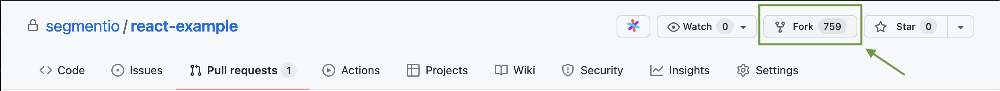

2.  Enable Github Actions for the repository through the `Actions` tab

    
    After enabling the button, you should be able to see the `Actions` view
    

3.  Grant the workflow correct repo permissions:

    - Go to the repository settings, and in the sidebar click `Actions` under the `Code and automation` section
      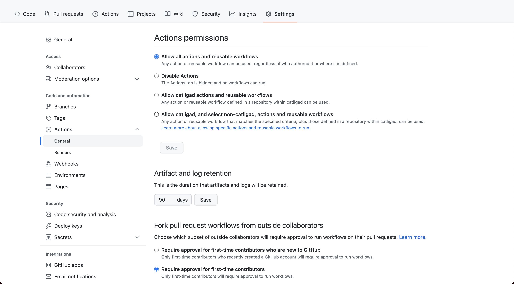
    - Scroll down to see the workflow settings:
      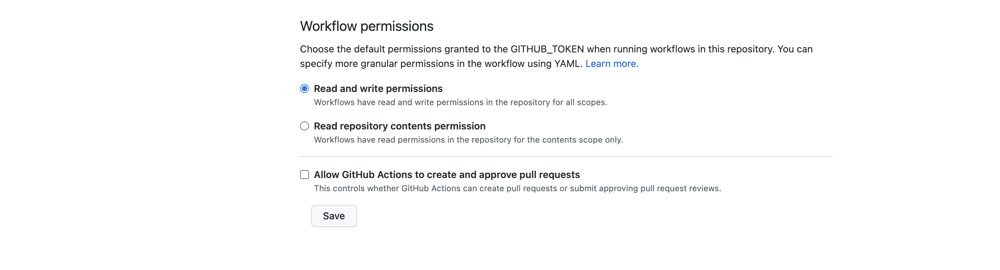
    - Select `read and write permissions` and Save.

4.  Add your Segment Source write key to Github Secrets

    - Continuing in the repository settings, in the sidebar click `Secrets` under the `Security` section
    - Click `New Repository Secret`
      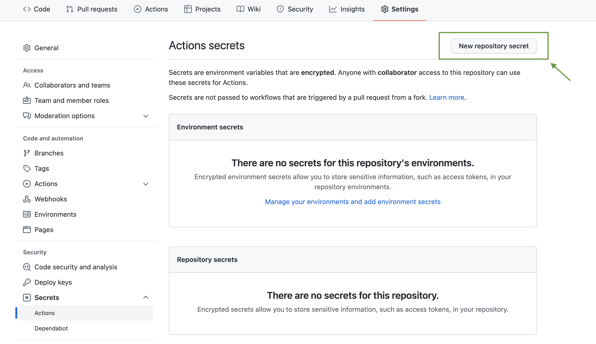
    - Add `REACT_APP_SEGMENT_WRITE_KEY` as the secret's name, with the source write key as the value
      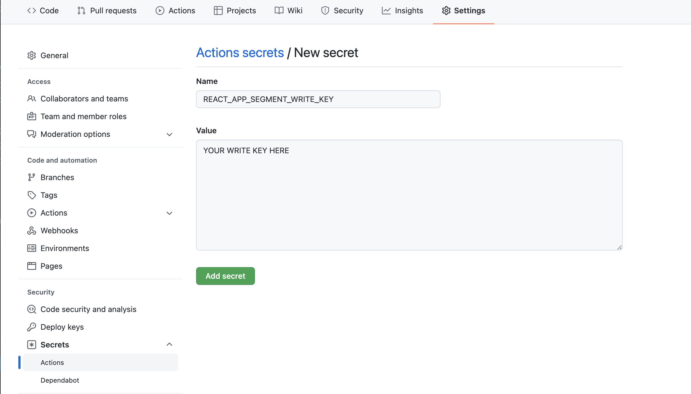

      After adding the secret to Github, you should be able to see your Secret:
      

5.  Configure Github Pages to use the `gh-pages` branch
    

6.  Copy the URL provided by Github in the `Pages` option under `Code and Automation` section in the sidebar

7.  Change the homepage URL in the `package.json` [file](https://github.com/segmentio/react-example/blob/main/package.json), using the URL copied from step 6. Make sure to commit your changes

    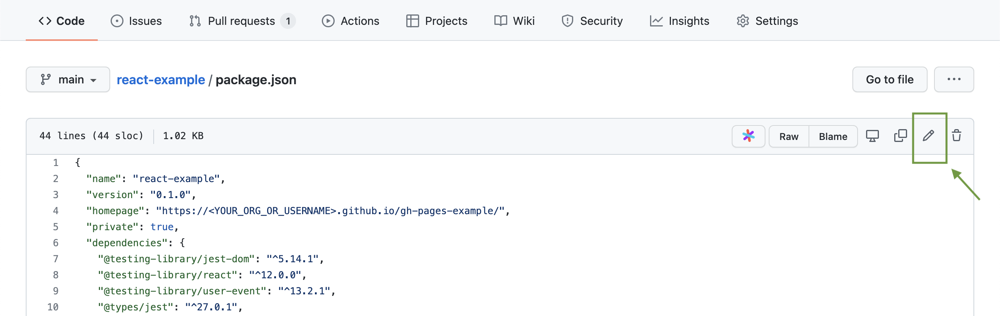
    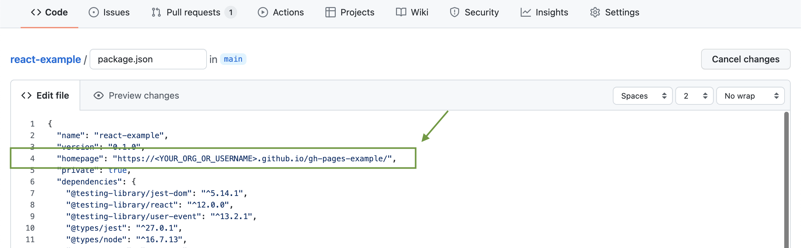

8.  Navigate to the URL copied from step 6, and click around, and see data flowing through your Source! _There might be a wait for the page to deploy. Average time should be around 1 minute._

## What's going on under the hood?

When instrumented, clicking around your webpage sends events to Segment. You can see these calls in the `Network` tab in your browser's `Developer Tools`:
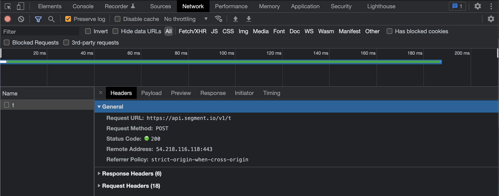


You should be able to navigate to your Source's debugger and see events flowing in real time:
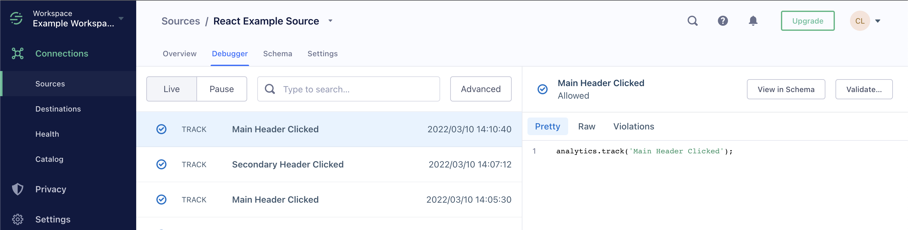

## Troubleshooting Deploy

If, when clicking through the website, you are not seeing events flowing through the debugger _and_ you do not see events being fired in `Developer Tools`, the Github Pages site might not be deployed correctly.

### Issue: The workflow is not deployed in the correct order

The website is properly deployed if the latest workflow run is the `Deploy to GH Pages` workflow:
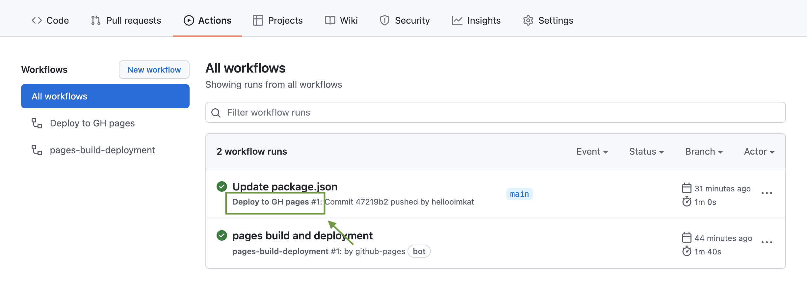

Sometimes, this is not the case, meaning that the `SOURCE_WRITE_KEY` environment variable was not correctly injected into the running App. If that happens, simply click the latest workflow run (in this case `Update package.json`), and rerun the workflow:
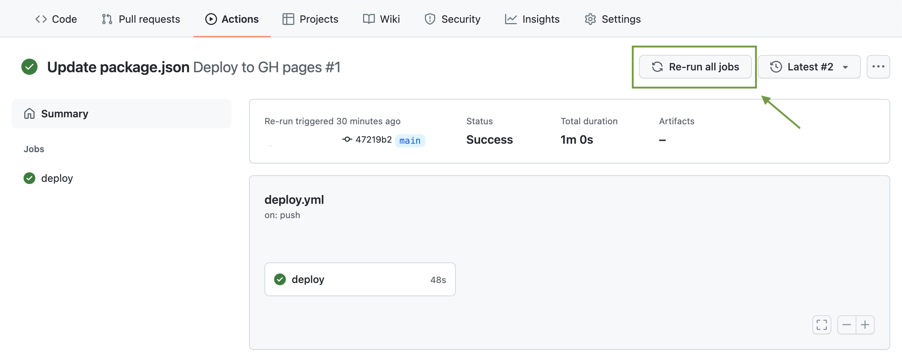

_Note: relatedly, not being able to access Segment's analytics will not impact your App from running._

## [Evergreen](https://evergreen.segment.com/)

The JSX examples in this repo use Segment's design system, Evergreen. [Check it out!](https://evergreen.segment.com/introduction/getting-started)

## Available Scripts

This typescript project was bootstrapped with [Create React App](https://github.com/facebook/create-react-app). You can learn more in the [Create React App documentation](https://facebook.github.io/create-react-app/docs/getting-started). To learn React, check out the [React documentation](https://reactjs.org/).

In the project directory, you can run:

### `yarn start`

To run the page with analytics calls, run

```
REACT_APP_SEGMENT_WRITE_KEY=<write_key_here> yarn start
```

Runs the app in the development mode.\
Open [http://localhost:3000](http://localhost:3000) to view it in the browser.

The page will reload if you make edits.\
You will also see any lint errors in the console.

### `yarn test`

Launches the test runner in the interactive watch mode.\
See the section about [running tests](https://facebook.github.io/create-react-app/docs/running-tests) for more information.

### `yarn build`

Builds the app for production to the `build` folder.\
It correctly bundles React in production mode and optimizes the build for the best performance.

The build is minified and the filenames include the hashes.\
Your app is ready to be deployed!

See the section about [deployment](https://facebook.github.io/create-react-app/docs/deployment) for more information.

### `yarn eject`

**Note: this is a one-way operation. Once you `eject`, you can’t go back!**

If you aren’t satisfied with the build tool and configuration choices, you can `eject` at any time. This command will remove the single build dependency from your project.

Instead, it will copy all the configuration files and the transitive dependencies (webpack, Babel, ESLint, etc) right into your project so you have full control over them. All of the commands except `eject` will still work, but they will point to the copied scripts so you can tweak them. At this point you’re on your own.

You don’t have to ever use `eject`. The curated feature set is suitable for small and middle deployments, and you shouldn’t feel obligated to use this feature. However we understand that this tool wouldn’t be useful if you couldn’t customize it when you are ready for it.

### `yarn deploy`

Builds & deploys to the Github Pages website specified in the `package.json`.

This repo has a [Github Action workflow](INSERT_LINK_TO_WORKFLOW_HERE), but you can deploy to your Github Page straight from the terminal using this command.

See this section about [deployment](https://github.com/tschaub/gh-pages#deploying-with-github-actions) for more information.
